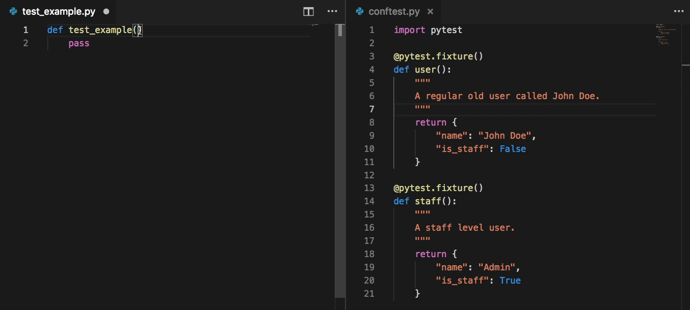

# VS Code Pytest Extension

⚠️ This addon is in alpha. Functionality and elegance are still be developed. If you encounter any issues, bug reports would be appreciated. ⚠️

A VS Code extensions that adds IntelliSense support for pytest fixtures.



This is a shameless inspired to port [Pycharm's pytest functionality](https://blog.jetbrains.com/pycharm/2018/08/pycharm-2018-2-and-pytest-fixtures/) over to VS Code.

## Setup.

The addon requires you to set your pytest command
(behind the scenes, the addon runs `pytest /path/to/test_file --fixtures` to get a list of fixtures)

If you are using a virtual environment, when inside of it, you can find the fully fledged path to pytest by running `which pytest`.

```bash
$ which pytest
/Users/cameron/.virtualenvs/demo-mLN-1lcH/bin/pytest
```

Then set `pytest.command` appropriately in your workspace settings.

```json
{
  "pytest.command": "/Users/cameron/.virtualenvs/demo-mLN-1lcH/bin/pytest"
}
```

If you are using pipenv, your setting might look like....

```json
{
  "pytest.command": "pipenv run pytest"
}
```

If you are running pytest instead of Docker compose, your setting might look similar too...

```json
{
  "pytest.command": [
    "eval",
    "$(docker-machine env default);",
    "docker-compose",
    "run",
    "--no-deps",
    "api",
    "pytest"
  ]
}
```

## Contributing

Contribution to this extension are welcome!
Before submitting any changes, please first discuss the changes you wish to make via an issue.
